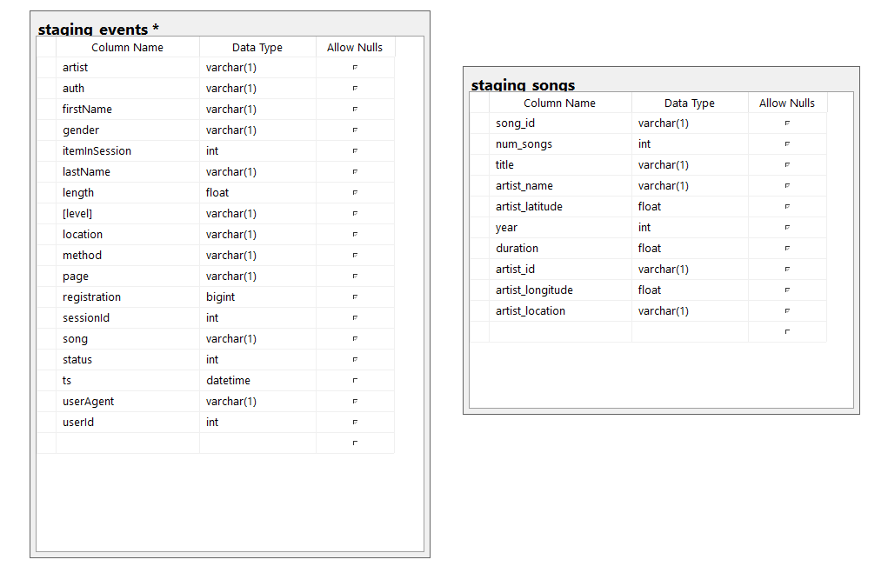
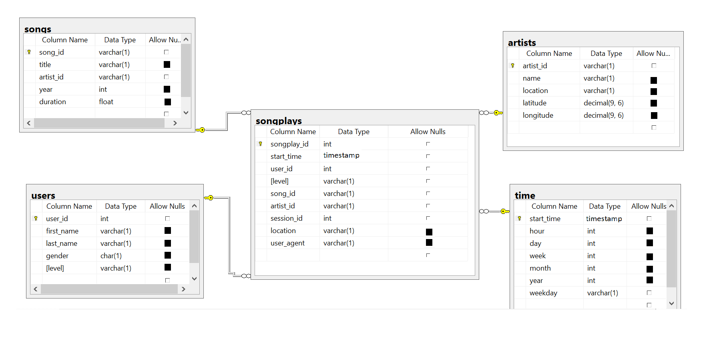

<h1>Introduction</h1>
Sparkify, music startup needs to analyze the data for the informed decisions which will directly help them to grow their business thourgh their user's trends.
Through this database we can add more value to the business of sparkify through user location, what type of artist user like whcih directly help sparkify to do personalized marketing and give user a personalized experience.

<h1>Database schema design</h1>
The purpose is to create dimensional model using star schema to optimize the data reading capabilty through optimized table desing by specifying distribution styles of data and sorting keys


- Following are the Staging tables which are using to populate Dimensions and Facts

[]

- Following is the Star Schema of my data model that load data from staging tables (staging_events and staging_songs) 

[]

<h1>Files description </h1>

- ```sql_queries.py``` contains all the sql queries includes table schema, inserting data from staging to dimensions and fact tables.
- ```create_tables.py``` calls sql_queries.py file which then drops and creates all staging, dimension and fact tables. Run this file to reset tables before each time we run etl.py.
- ```etl.py``` copying data form s3 bucket to staging tables and then staging to facts and dimensions.
- ```dwh.cfg``` contain configuration of aws services (s3, redshift, iamrole)
- ```README.md``` provides description of Project

<h1>Dimension Model and ETL Process </h1>

In this project, 1 fact and 4 dimension tables have modeled and ETL process is created through S3, Redshift and Postgres. 

- Staging Tables
* (staging_events) table data is populated by copying data from LOG_DATA which exists in s3 bucket
* (staging_songs) table data is populated by copying data from SONG_DATA which exists in s3 bucket

- Fact Table
* (songplays) table is created from the join of both staging tables (staging_events and staging_songs) 

- Dimension Tables
* (users) table is created from staging table staging_events
* (songs) table is created form staging table staging_songs
* (artists) table is created from staging table staging_songs
* (time) table is created from staging table staging_events

<h2>ETL Workflow:</h2>

- ETL Design is simplified, first step to copying data from s3 source to staging tables (staging_events and staging_songs)  and then facts and dimensional and fact tables are populated from staging with transformation.


<h2>Project Workflow</h2>

- first run create_tables.py file which create all the tables on terminal through
```python create_tables.py```
- second step is to run etl.py file which contain all etl jobs thorugh
```python etl.py```
- in this way data is loaded
